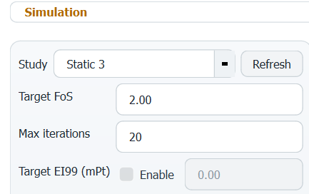

# SustainX
<table align="center">
<tr>
<td>

## Intelligent Tool for Sustainable Mechanical Design Using Eco-Indicator 99

</td>

<td>

</td>

</tr>
</table>

<!-- ## Intelligent Tool for Sustainable Mechanical Design Using Eco-Indicator 99

 -->

## Overview
 SustainX is a Python-based tool that automates the assessment and enhancement of environmental impact for mechanical products from only **CAD** models.

 It directly integrates with **SolidWorks** to calculate **Eco-Indicator 99** points and enhances dimensions automatically **to reduce the environmental impact of designs**, while maintaining the **factor of safety** within satisfactory limits.

 The tool currently supports **gearbox casings** as a case study.

## Key Features

<table>
<tr>
<td>

### Environmental Impact Assessment
 SustainX automatically calculates the environmental points of **CAD** models based on the [Eco-Indicator 99 Manual for Designers](https://pre-sustainability.com/files/2013/10/EI99_Manual.pdf) for both parts and assembly files (`.SLDPRT` , `.SLDASM`).

</td>

<td>

</td>

</tr>
</table>

---

<table>
<tr>
<td>

#### Select Fuel for Casting Process
 Gearbox casings are primarily manufactured using casting, so the designer can select the fuel and efficiency of the casting furnace.

</td>

<td>
  
</td>

</tr>
</table>

---

#### Definition of Machining Processes
 The designer defines names of machined parts such as bolt holes for `drilling`, and offset surfaces for `grinding`, `boring` and `milling` in the **CAD model** with specific naming conventions.

<table>
  <tr>
    <th>Keyword</th>
    <th>Meaning</th>
    <th>Notes</th>
  </tr>

  <tr>
    <td align="left"><code>BOLT_HOLE</code></td>
    <td align="left">Hole volume feature</td>
    <td align="left">Assign keyword for holes made through drilling</td>
  </tr>

  <tr>
    <td align="left"><code>BASE_SURFACE</code></td>
    <td align="left">Grinding surface</td>
    <td align="left">Assumed removed depth: 0.2mm</td>
  </tr>

  <tr>
    <td align="left"><code>CONTACT_SURFACE</code></td>
    <td align="left">Milling surface</td>
    <td align="left">Assumed removed depth: 0.5mm</td>
  </tr>

  <tr>
    <td align="left"><code>BEARING_SURFACE</code></td>
    <td align="left">Boring surface</td>
    <td align="left">Assumed removed depth: 0.5mm</td>
  </tr>

</table>

The tool reads the volume of drilled bolt holes and the area of machining surfaces to calculate processing points.

---

<table align="center">
<tr>
<td>

#### Select Transportation Settings
 Choose transportation methods and distances from various options.

</td>

<td>

</td>

</tr>
</table>

---

<table align="center">
<tr>
<td>

#### Select End-of-Life Method
 Choose between **recycling** and **landfill** disposal.

</td>

<td>
  
</td>

</tr>
</table>

---

#### Eco-Indicator 99 Tables Results
 The tool generates environmental tables with one click, covering tables for **production, processing, transportation** and **end-of-life**.

---

### Enhancement of Environmental Impact
 SustainX tool allows designers to select specific dimensions to manipulate iteratively for weight reduction which subsequently reduces environmental impact.

---

<table>
<tr>
<td>

#### Iterations of EI99 Improvement
 Designers simply write names of desired dimensions and specify the step, limit, and direction (reduce/increase).\
 Specified dimensions are changed in each iteration and the tool calculates the _**EI99 value**_ after each iteration and records it.

 >Example: `Thickness@Flange`, `Step: 1mm`, `Reduce`, `Min: 5mm`.

</td>

<td>
  
</td>

</tr>
</table>

---

#### Factor of Safety Evaluation
 The tool uses _**SolidWorks Simulation**_ to run _**finite element analysis (FEA)**_ for each iteration to evaluate the factor of safety of design to keep it within _**user-defined limits**_.

---

<table>
<tr>
<td>

#### Stopping Conditions
Simulation iterations stop when:
- A specified maximum number of iterations are completed.
- The minimum FoS is reached.
- The target EI99 points are achieved.

</td>

<td>

</td>

</tr>
</table>

 ---

#### Optimization Results
For each iteration, the tool populates a table with each dimension's value, maximum stress, FoS, and eco-indicator points.

---

### Identification of Best Optimization Iteration
The tool projects each iteration on a _**scatter plot**_ of EI99  (x-axis) and FoS (y-axis), and highlights the **best Pareto trade-off** iteration between both parameters.

----

### Exporting Results
Results from both environmental assessment and optimization iterations can be exported into `CSV`, `DOCX`, and `PDF` formats through one click.
>[A sample report generated by SustainX tool](Assets/Sample_Report.pdf)

---

## Research Results

>#### SustainX achieved `~53%` reduction in EI99 points, with a massive `98%` reduction in computational time.

<table>
  <tr>
    <th>Parameter</th>
    <th>Designer (4 Iterations)</th>
    <th>SustainX Tool (20 Iterations)</th>
  </tr>

  <tr>
    <td align="left">Computation Time</td>
    <td align="left">330 min</td>
    <td align="left">6 min 51 s</td>
  </tr>

  <tr>
    <td align="left">Time Reduction</td>
    <td align="left">baseline</td>
    <td align="left">97.9%</td>
  </tr>

  <tr>
    <td align="left">EI99 Score (mPt)</td>
    <td align="left">1,978.93</td>
    <td align="left">3,513.77</td>
  </tr>

  <tr>
    <td align="left">EI99 Improvement</td>
    <td align="left">74.0%</td>
    <td align="left">53.8%</td>
  </tr>

  <tr>
    <td align="left">Factor of Safety (FOS)</td>
    <td align="left">2.8</td>
    <td align="left">14.0</td>
  </tr>

  <tr>
    <td align="left">FOS Reduction</td>
    <td align="left">94.7%</td>
    <td align="left">72.2%</td>
  </tr>
</table>

---

# 🏆 Awards & Recognition

### 🥇 1st Place Winner — 15th Undergrad Research Competition by TCCD

*SustainX* was awarded **First Place** in the 15th undergraduate research competition by the **Technical Center for Career Development** at the **Faculty of Engineering - Cairo University**.

## 👥 Team Members

| Name | Role | |
|---|---|---|
| Gamal Wail | Team Leader | Mechanical Design and Production Engineering Department, Cairo University|
| Ahmed Hajhamed | Tech Team |Systems and Biomedical Engineering Department, Cairo University|
| Abdelrahman Elomeiri | Mechanical Team |Mechanical Energy and Power Engineering Department, Cairo University|
| Fatima-Alzahraa Kamal | Eco Team |Chemical Engineering Department, Cairo University|
| Noura Abdulbasit | Mechanical Team |Mechanical Design and Production Engineering Department, Cairo University|
| Awab Ibrahim | Tech Team |Electrical Power Engineering Department, Cairo University|

---

>## Checkout SustainX in action!

>

