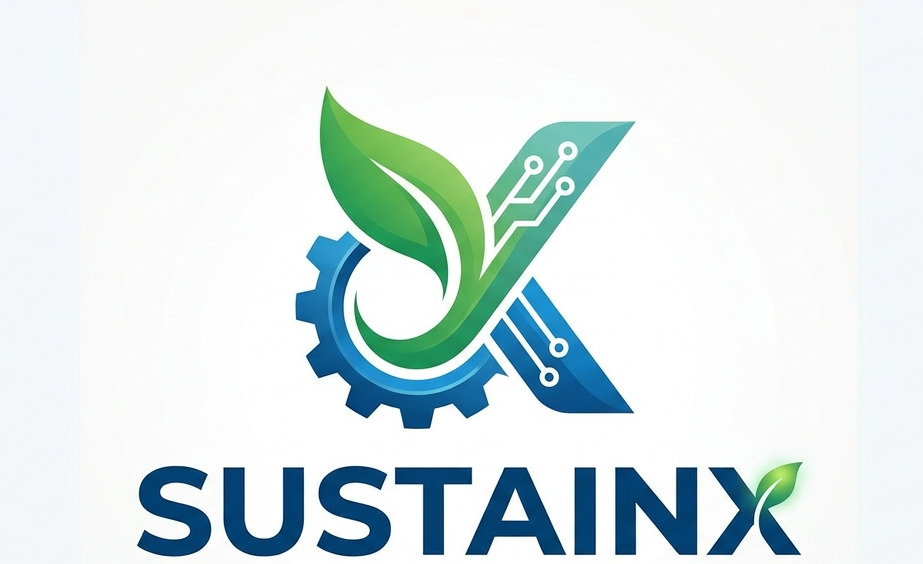
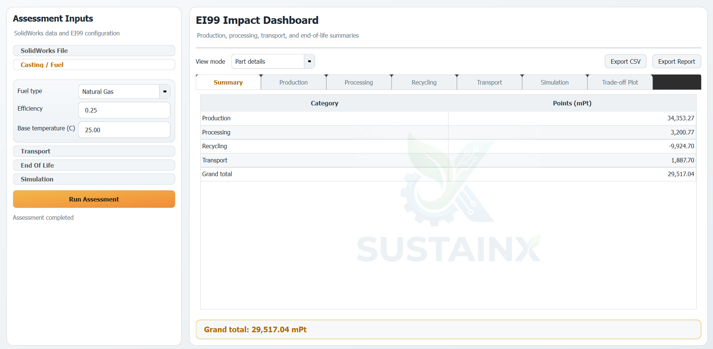
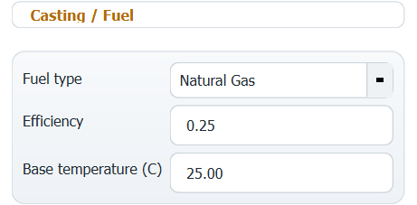
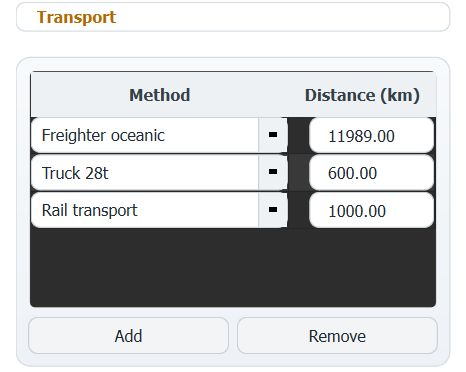
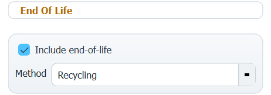

# SustainX
<table align="center">
<tr>
<td>

## Intelligent Tool for Sustainable Mechanical Design Using Eco-Indicator 99

</td>

<td>

</td>

</tr>
</table>

<!-- ## Intelligent Tool for Sustainable Mechanical Design Using Eco-Indicator 99

 -->

## Overview
 SustainX is a python-based tool that automates the assessment and enhancement of environmental impact for mechanical products from only **CAD** models.

 It directly integrates with **SolidWorks** to calculate eco indicator 99 points and enhances dimensions automatically 𝐭𝐨 𝐫𝐞𝐝𝐮𝐜𝐞 𝐭𝐡𝐞 𝐞𝐧𝐯𝐢𝐫𝐨𝐧𝐦𝐞𝐧𝐭𝐚𝐥 𝐢𝐦𝐩𝐚𝐜𝐭 𝐨𝐟 𝐝𝐞𝐬𝐢𝐠𝐧𝐬, while maintaining the 𝐟𝐚𝐜𝐭𝐨𝐫 𝐨𝐟 𝐬𝐚𝐟𝐞𝐭𝐲 within satisfactory limits.

 The tool currently supports **gearbox casings** as a case study.

## Key Features

<table>
<tr>
<td>

### Environmental Impact Asseessment
 SustainX automatically calculated the environmental points of **CAD** models based on the [Eco-Indocator 99 Manual for Designers](https://pre-sustainability.com/files/2013/10/EI99_Manual.pdf) for both parts and assembly files (`.SLDPRT` , `.SLDASM`).

</td>

<td>

</td>

</tr>
</table>

---

<table>
<tr>
<td>

#### Select Fuel for Casting Process
 Gearbox casings are primarily maufactured using casting, so designer can select the fuel and efficiency of the casting furnce.

</td>

<td>
  
</td>

</tr>
</table>

---

#### Definition of Machining Processes
 The designer defines names of machined parts such as bolt holes for `drilling`, and offset surfaces for `grinding`, `boring` and `milling` in the **CAD model** with specific naming conventions.

| Keyword | Meaning | Notes |
|---------|:---------:|-------|
| `BOLT_HOLE`| Hole volume feature| Assign keyword for holes made through drilling|
| `BASE_SURFACE`| Grinding surface | Assumed removed depth: 0.2mm |
| `CONTACT_SURFACE`| Milling surface | Assumed removed depth: 0.5mm|
| `BEARING_SURFACE`| Boring surface | Assumed removed depth: 0.5mm|

The tool reads the volume of drilled bolt holes and reads the area of machining surfaces to calculate processing points.

---

<table align="center">
<tr>
<td>

#### Select Transportation Settings
 Choose trasportation methods and distances from various option.

</td>

<td>

</td>

</tr>
</table>

---

<table align="center">
<tr>
<td>

#### Select End-of-Life Method
 Choose between **recycling** and **landfill** disposal.

</td>

<td>
  
</td>

</tr>
</table>

---

#### Eco-Indicator 99 Tables Results
 The tool generates environmental tables with one click, which are tables for **production, processing, transportation** and **end-of-life**.

---

### Enhancement of Envirenmental Impact
 SustainX tool allows designers to select specific dimensions to manipulate iteratively for wieght reduction with subsquently reduces environmental impact.

---

<table>
<tr>
<td>

#### Iterations of EI99 Improvement
 Designers simply write names of desired dimensions and specify the step, limit, and direction (reduce/increase).\
 Specified dimensions are changed in each iteration and the tool calculates the _**EI99 value**_ after each iteration and records it.

 >Example: `Thickness@Flange`, `Step: 1mm`, `Reduce`, `Min: 5mm`.

</td>

<td>
  
</td>

</tr>
</table>

---

#### Factor of Safety Evaluation
 The tool uses _**SolidWorks Simulation**_ to run _**finite element analysis (FEA)**_ for each iteration to evaluate the factor of safety of design to keep it within _**user-defined limits**_.

---

<table>
<tr>
<td>

#### Stopping Conditions
Simulation iterations stop when: a specified maximum number of iterations are completed, minimum FoS is reached, or target EI99 points are achieved.

</td>

<td>

</td>

</tr>
</table>

 ---

#### Optimization Results
For each iteration, the tool populates a table with each dimension's value, maximum stress, FoS, and eco-indicator points.

---

### Identification of Best Optimization Iteration
The tool projects each iteration of a _**scatter plot**_ of EI99  (x-axis) and FoS (y-axis), and highlights the **best Pareto trade-off** iteration between both parameters.

----

### Exporting Results
Results from both environmental assessment and optimization iterations can be expoirted into `CSV`, `docx`, and `PDF` formats through one click.
>[A sample report generated by SustainX tool](<assets/Sample Report.pdf>)
